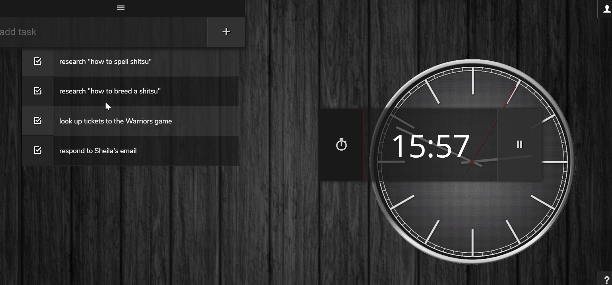

# Pomodoro
Enhance your productivity.

### Tech
* Angular
* [Google Firebase](https://firebase.google.com/docs/auth/) Authentication

---

Built on the popular **[Pomodoro Technique](https://en.wikipedia.org/wiki/Pomodoro_Technique)**.

## Welcome to Better Time Management

Your new workflow is broken into **work** and **break** sessions:
  * **Work** session [25 mins]
  * **Break** session [5 mins]
  * **Long Break** session [30 mins] (every 4th **break**)

## Start By Adding Tasks

Explicitly defining a list of tasks prior to beginning work can help reinforce the purpose and intent of your work session while lending some estimation of the path ahead.

## Start the Timer

## Mark Tasks Complete

Select a task's **checkbox** to the left to mark it as **complete**.

**Completed tasks** make their way to the bottom of the list to draw attention to what's next as well as creating a feeling of accomplishment.

Click the **trash** icon to dismiss a completed task. 

## Take a Break

The app will **chime** once you've completed a work session to tell you it's time to **take a break**! 

The timer will **reset** to the appropriate break session based on how many work cycles you've completed:
  * **Break** [5 mins]
  * **Long Break** [30 mins] (every 4th **break**)

**Skip** the break session by clicking the running man if you're feeling extra ambitious.

## Persistent Tasks with Authentication

Sign into the application if you want to persist your tasks from session to session.
